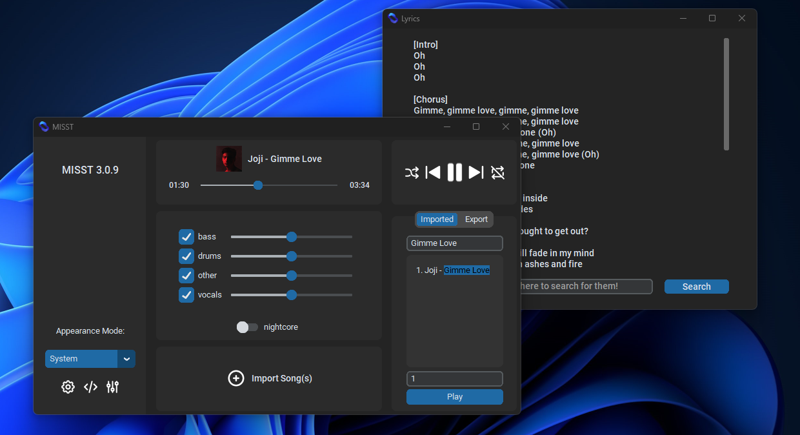
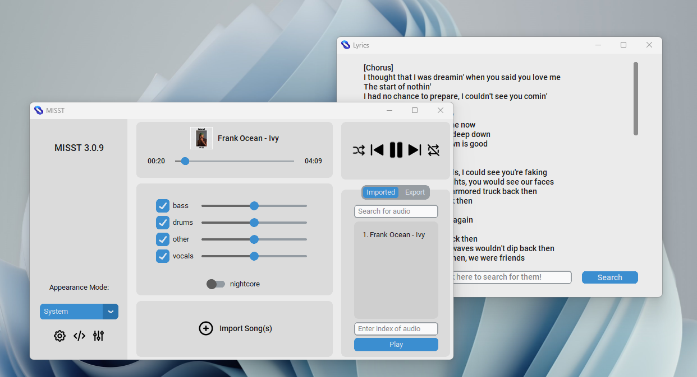
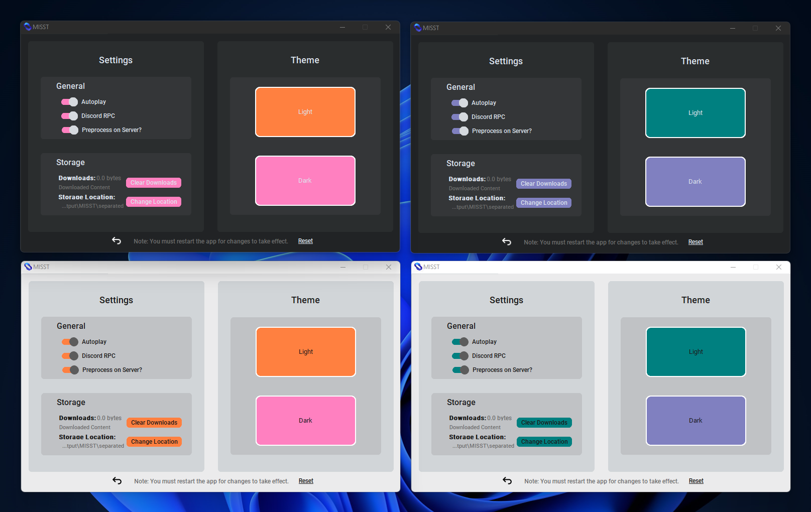

<div align="center">

[](https://github.com/Frikallo/MISST)
[](https://github.com/Frikallo/MISST/releases/latest) [](https://github.com/Frikallo/MISST/releases/latest) [](https://github.com/Frikallo/MISST/blob/main/LICENSE) [](https://github.com/Frikallo/MISST/graphs/contributors) [](https://betteruptime.com/?utm_source=status_badge)

</div>

---


| _`MISST` on Windows 11 with Dark mode and 'Blue' theme with 'Kanye West's All of The Lights' playing_


| _`MISST` on Windows 11 with Light mode and 'Blue' theme with 'Beabadoobee's Cologne' playing_


| _`MISST` on Windows 11 Showcasing how versatile and personal you can be with MISST!_

###

Original Repository of MISST : **M**usic/**I**nstrumental **S**tem **S**eparation **T**ool.

This application uses state-of-the-art source separation models to extract the 4 core stems from audio files (Bass, Drums, Other Instrumentals and Vocals). But it is not limited to this. MISST acts as a developped music player aswell, fit to enjoy and medal with your audio files as you see fit. MISST even comes prepared to import songs and playlists directly from your music library.

This project is OpenSource, feel free to use, study and/or send pull request.

## Objectives:
- [x] Import songs and playlists from your music library
- [x] Play your songs and playlists
- [x] Extract and manipulate the 4 core stems from your audio files as they play
- [x] Save your stems as audio files
- [x] If imported from your music library, view lyrics and metadata just as you would in your old music player
- [x] Minimal memory usage
- [x] Customizable themes
- [x] Additional Efects like nightcore
- [x] Easy to use equalizer
- [x] Preprocessing service available for offline use
- [ ] Docker image (WIP)
- [ ] Make it as fast as possible (Preprocessing, Model loading, etc.) (Not a priority)
- [ ] Stable on Windows, Linux and MacOS (Not a priority)
- [x] Proper installer/updater


## Installation
as of version 2.0.6, MISST is only available on windows with guaranteed compatibility. Until a later release, please refer to [Manual Installation](https://github.com/Frikallo/MISST/#manual-installation). 

## Manual Installation
These instructions are for those installing MISST v3.0.2 **manually** only.

1. Download & install Python 3.9 or higher (but no lower than 3.9) [here](https://www.python.org/downloads/)
    - **Note:** Ensure the *"Add Python to PATH"* box is checked
2. Download the Source code [here](https://github.com/Frikallo/MISST/releases/latest)
3. Open the command prompt from the src directory and run the following commands, separately - 

```
$ pip install -r requirements.txt
$ pip install torch==1.9.0+cu111 torchvision==0.10.0+cu111 torchaudio==0.9.0 -f https://download.pytorch.org/whl/torch_stable.html
```
- **Note:** The last two commands are only necessary if you intend to host an instance of the MISST server.

From here you should be able to open and run the MISSTapp.py file

- FFmpeg 

    - FFmpeg must be installed and configured for the application to process any track that isn't a *.wav* file. You will need to look up instruction on how to configure it on your operating system.

## License

The **MISST** code is [GPL-licensed](LICENSE). 

- **Please Note:** For all third-party application developers who wish to use our models, please honor the GPL license by providing credit to MISST and its developer.

## Issue Reporting

Please be as detailed as possible when posting a new issue. 

If possible, check the "MISST.log" file in your install directory for detailed error information that can be provided to me.

## Contributing

- For anyone interested in the ongoing development of **MISST**, please send us a pull request, and I will review it. 
- This project is 100% open-source and free for anyone to use and modify as they wish. 
- I only maintain the development for **MISST** and the models provided. 

## More documentation to come...